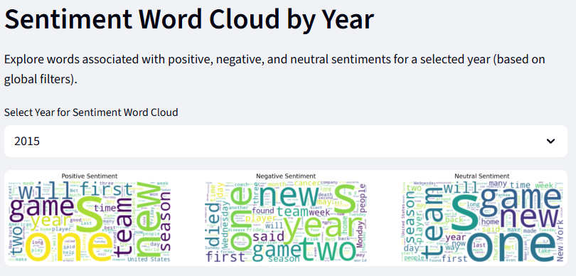

# 📰 News Sentiment Analysis

## 🚀 Project Overview

This project provides an end-to-end pipeline for **News Sentiment Analysis and Clustering**, guiding you from raw data acquisition to an interactive, insightful dashboard. The process meticulously covers:

1.  **Collecting raw news article data** from a public dataset.
2.  **Filtering** this data to a specific date range (2015-2024).
3.  **Creating a filtered CSV file and backing it up to an AWS S3 bucket.**
4.  **Downloading this filtered data from S3** for subsequent cleaning and text preprocessing.
5.  **Developing machine learning models** for content understanding.
6.  **Calculating sentiment scores** and persisting all processed data and models into a PostgreSQL database.
7.  **Building an insightful Streamlit dashboard** for interactive exploration of news sentiment and article clusters.

---

## 💡 Project Motivation: Why News Sentiment Analysis?

In today’s fast-paced information age, news sentiment analysis has become a powerful tool for individuals, organizations, and researchers to gauge public mood, track trends, and make data-driven decisions. By analyzing and clustering news articles, this project empowers users to uncover hidden patterns in media coverage, monitor sentiment shifts over time, and identify emerging topics or biases. Whether you are a data scientist, journalist, financial analyst, or simply a news enthusiast, the interactive dashboard provides actionable insights that can inform strategic choices, enrich research, and foster a deeper understanding of how news shapes our world.

---

## ✨ Features

-   🤖 **Raw Data Collection:** Automates the collection of a large news article dataset from Kaggle.
-   ⏳ **Date Filtering:** Filters the collected raw data to include articles from 2015 to 2024.
-   ☁️ **AWS S3 Backup & Retrieval:** Securely backs up the filtered raw data to an S3 bucket and allows for easy retrieval for further processing.
-   🧼 **Data Cleaning:** Handles missing values, extracts key information (dates, headlines), and filters articles by relevant categories and dates.
-   📝 **Text Preprocessing:** Utilizes NLTK for essential text operations including tokenization, lemmatization, and stopword removal to prepare content for analysis.
-   📈 **Feature Extraction:** Transforms textual content into numerical vectors using TF-IDF, making it suitable for machine learning algorithms.
-   🔎 **K-Means Clustering:** Groups similar news articles into distinct clusters based on their extracted content features.
-   😄 **VADER Sentiment Analysis:** Accurately calculates detailed polarity scores (negative, neutral, positive, and compound) for each news article.
-   🗃️ **PostgreSQL Integration:** Stores all processed news data (with sentiment and cluster information) and trained machine learning models for persistent, efficient access by the dashboard.
-   🌐 **Interactive Streamlit Dashboard:** Provides a user-friendly interface with:
    -   **Global Filters:** Apply selections for date range, news category, and article cluster to refine insights.

## 📌 Dashboard Visualizations

-   📊 **Sentiment Score Distribution**
-   🌡️ **Heatmap of Sentiment by Day & Category**
-   📈 **Daily/Weekly News Volume Trend**
-   📌 **Top N Articles by Sentiment**
-   ☁️ **Word Cloud by Cluster**
-   📉 **Sentiment Extremes Over Time**
-   📂 **Category-wise Sentiment Bar Chart**
-   📉 **Category Sentiment (Bar + Line)**
-   📊 **Category Cluster Comparison Table**
-   ☁️ **Sentiment Word Cloud**

---

## 🖼️ Screenshots

### Sentiment Score Distribution


### Heatmap of Sentiment by Day and Category


### Daily or Weekly News Volume Trend


### Top N Articles by Sentiment


### Word Cloud by Cluster


### Sentiment Extremes Over Time


### Category-wise Sentiment Bar Chart


### Category Sentiment Bar and Line Chart


### Category Cluster Comparison Table


### Sentiment Word Cloud


---

## 🗄️ Data Source

The project utilizes the "NYT Articles (21M+, 2000-Present)" dataset available on Kaggle.
To download, use the Kaggle CLI command: `kaggle datasets download -d aryansingh0909/nyt-articles-21m-2000-present`

## ⚙️ Prerequisites

Before running the project, ensure you have the following installed:

* **Python 3.8+**
* **PostgreSQL Database:** A running PostgreSQL instance (e.g., AWS RDS PostgreSQL) is required to store the processed data and the ML model.
* **AWS Account:** For utilizing S3 for raw data storage and retrieval, and potentially EC2 for deployment.
* **Kaggle API Key:** To download the dataset programmatically if you prefer not to download it manually.
* **System-level dependencies for `psycopg2`:**
    * On Ubuntu/Debian: `sudo apt install libpq-dev python3.x-dev build-essential` (replace `3.x` with your Python version, e.g., `3.12`)
    * On Amazon Linux: `sudo yum install postgresql-devel python3-devel gcc`

## 📦 Installation & Deployment on AWS EC2

This guide assumes you have an AWS EC2 instance (e.g., Ubuntu) up and running.

1.  **Connect to your EC2 instance** via SSH.

2.  **Update system packages and install prerequisites:**
    ```bash
    sudo apt update
    sudo apt install python3.12-dev  # Replace 3.12 with your Python version
    sudo apt install libpq-dev build-essential
    ```

3.  **Clone the repository:**
    ```bash
    git clone <your-repository-url>
    cd <your-repository-name> # e.g., cd News_Senticonomy
    ```

4.  **Create a virtual environment (recommended):**
    ```bash
    python3.12 -m venv venv # Use python3.12 or your specific Python version
    source venv/bin/activate
    ```

5.  **Install Python dependencies:**
    The `requirements.txt` file should contain:
    ```
    pandas
    numpy
    scikit-learn
    matplotlib
    wordcloud
    nltk
    psycopg2-binary # Use psycopg2-binary for easier installation, or psycopg2 if you prefer to compile
    sqlalchemy
    plotly
    seaborn
    streamlit
    boto3
    python-dateutil
    pytz
    joblib
    ```
    Install them:
    ```bash
    pip install -r requirements.txt
    ```

6.  **NLTK Data Downloads:**
    The `model.py` script automatically checks and downloads necessary NLTK data (`punkt`, `wordnet`, `stopwords`, `vader_lexicon`) when run.

---

## 🔐 Configuration

1.  **AWS Credentials (`.vscode/secrets.json`):**
    The project uses a `secrets.json` file to store sensitive credentials.
    Create the directory and file if they don't exist:
    ```bash
    mkdir -p .vscode
    touch .vscode/secrets.json
    ```
    Then, open the file using a text editor (like `nano`) and add your AWS Access Key and Secret Key, and your PostgreSQL database password:
    ```bash
    nano .vscode/secrets.json
    ```
    Paste the following content, replacing the placeholder values:
    ```json
    {
        "AWS_ACCESS_KEY": "YOUR_AWS_ACCESS_KEY_ID",
        "AWS_SECRET_KEY": "YOUR_AWS_SECRET_ACCESS_KEY",
        "db_password": "YOUR_DB_PASSWORD"
    }
    ```
    Save and exit (`Ctrl+X`, `Y`, `Enter`).

    > ⚠️ **Security Note:** For production environments on AWS EC2, it's highly recommended to use **IAM Roles for EC2** instances instead of hardcoding AWS access keys. This grants permissions to the instance itself, eliminating the need to store credentials directly on the machine.

2.  **PostgreSQL Credentials (Environment Variables):**
    The Python scripts use environment variables for PostgreSQL connection details (Host, Name, User, Port). Set these before running your scripts:
    ```bash
    export DB_HOST="your_rds_endpoint" # e.g., database-1.c3eic0i08xdc.ap-south-1.rds.amazonaws.com
    export DB_NAME="your_database_name" # e.g., postgres
    export DB_USER="your_username" # e.g., postgres
    # DB_PASSWORD is read from .vscode/secrets.json
    export DB_PORT="5432" # Default PostgreSQL port
    ```
    Ensure your PostgreSQL database instance (e.g., your AWS RDS PostgreSQL) is running and your user has the necessary permissions. Also, configure your EC2 instance's security group to allow outbound traffic to your RDS instance on port 5432, and your RDS instance's security group to allow inbound traffic from your EC2 instance's security group.

---

## ▶️ Usage - Step-by-Step Pipeline

Follow these steps to run the complete news sentiment analysis and clustering pipeline:

1.  **Collect and Filter Raw Data:**
    Download the dataset from Kaggle manually or using the Kaggle CLI, and place `nyt-articles-21m-2000-present.zip` in the project root. Then execute `data_collection.py` which will collect and filter the raw data for the period 2015-2024.
    ```bash
    python data_collection.py
    ```

2.  **Upload Filtered Data to AWS S3 (Backup):**
    This step creates a `raw_data.csv` file with the filtered data and uploads it to your configured AWS S3 bucket for backup purposes.
    ```bash
    python aws_upload.py
    ```

3.  **Download Data from AWS S3 for Processing:**
    Retrieve the `raw_data.csv` from your S3 bucket. This file will then be used as input for the data cleaning and subsequent steps.
    ```bash
    python aws.download.py
    ```

4.  **Perform Data Cleaning & Preprocessing:**
    This script processes the downloaded `raw_data.csv` to clean the data and prepare it for model development.
    ```bash
    python data_cleaning.py
    ```

5.  **Develop Models, Calculate Sentiment, and Store in DB:**
    This script performs crucial steps including text preprocessing, K-Means clustering, and VADER sentiment analysis. It then pushes the final processed data, along with sentiment scores and cluster assignments, to the PostgreSQL table `news_data_final`. It also stores the trained machine learning models (TF-IDF Vectorizer and K-Means Model) in the `ml_models` database table.
    ```bash
    python model.py
    ```

6.  **Launch the Insightful Dashboard!**
    Start the interactive Streamlit dashboard to visualize and explore the news sentiment and article clusters.
    ```bash
    streamlit run data_visualisation.py --server.port 8501 --server.enableCORS true --server.enableXsrfProtection false
    ```
    * **Accessing the Dashboard:** After running the above command, Streamlit will typically output URLs like `http://localhost:8501` and `http://network_ip:8501`. You will need to use your EC2 instance's **Public IP address** and ensure that your EC2 instance's **Security Group** has an inbound rule allowing TCP traffic on port `8501` (or your chosen port) from your IP address or `0.0.0.0/0` (for public access, but use with caution).
    * **Example URL:** Once deployed and running, you can access your dashboard at a URL similar to: `http://13.232.180.169:8501/`

---

## 🗄️ Database Schema

-   **`news_data_final`**: Table storing cleaned, enriched news articles with sentiment and cluster information.
    -   `date` (DATE): Date of the news article.
    -   `category` (TEXT): Category of the news article (e.g., 'Technology', 'Sports').
    -   `cluster` (INTEGER): The cluster ID assigned to the article by K-Means.
    -   `headline` (TEXT): The main headline of the article.
    -   `content` (TEXT): The primary content/lead paragraph of the article.
    -   `compound` (NUMERIC): Compound sentiment score (VADER).
    -   `neg` (NUMERIC): Negative sentiment score (VADER).
    -   `neu` (NUMERIC): Neutral sentiment score (VADER).
    -   `pos` (NUMERIC): Positive sentiment score (VADER).
-   **`ml_models`**: Table for storing serialized (persisted) machine learning models.
    -   `id` (SERIAL PRIMARY KEY): Unique identifier for the stored model.
    -   `model_name` (TEXT): Name of the model (e.g., 'tfidf_vectorizer', 'kmeans_model').
    -   `model_data` (BYTEA): Binary representation of the serialized model data.
    -   `created_at` (TIMESTAMP): Timestamp when the model was stored.

---

## 👋 Contributing

Contributions are welcome! Please feel free to open issues or submit pull requests.
